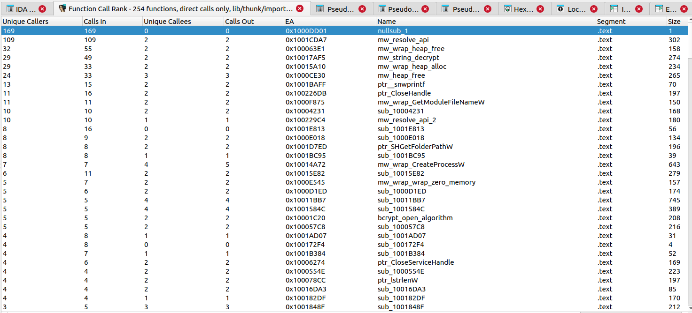

# ida-func-call-rank

A lightweight IDAPython plugin that adds a **sortable, Ghidra-like function
call-ranking table** to IDA Pro.

`ida-func-call-rank` ranks functions by static call relationships recognized
by IDA — incoming direct calls, unique callers, outgoing direct calls, and
unique callees — and presents them in a single sortable view.

It is useful for early reverse-engineering triage, especially when looking
for frequently reused helpers such as hash routines, decryptors, API
wrappers, dispatchers, VM helpers, loggers, and other common utility
functions.

> Find heavily reused functions at a glance.



---

## Features

- Sortable function call ranking table
- `Calls In` — incoming direct call xrefs
- `Unique Callers` — distinct caller functions
- `Calls Out` — outgoing direct call xrefs
- `Unique Callees` — distinct callee functions
- `Recursive` — self-recursive call count (shown as a column and included in CSV)
- `Unknown` — outgoing calls whose target is not inside any recognized function
- Jump to function on double-click / Enter
- Optional filters: hide library / thunk / extern (import) / zero-caller functions
- CSV export of the current (filtered) view
- Right-click context menu inside the chooser
- Hotkey: `Ctrl-Shift-C`

---

## Install

1. Copy `ida_func_call_rank.py` into your IDA per-user `plugins/` directory:

   | Platform | Path |
   |---|---|
   | Windows | `%APPDATA%\Hex-Rays\IDA Pro\plugins\` |
   | Linux   | `~/.idapro/plugins/` |
   | macOS   | `~/Library/Application Support/IDA Pro/plugins/` |

2. **Restart IDA.** Plugins in the per-user `plugins/` directory are scanned
   only at startup, so the entry will not appear until IDA is relaunched.
3. After restart, run it via **Edit → Plugins → Function Call Rank** or the
   `Ctrl-Shift-C` hotkey, on any open IDB.

Requirements: IDAPython 3. Tested against IDA 7.x / 8.x / 9.x APIs;
confirmed working on IDA Pro 8.4.

---

## Usage

1. Open a binary and let IDA finish auto-analysis.
2. Press `Ctrl-Shift-C`, or pick **Edit → Plugins → Function Call Rank**.
3. The chooser opens with functions sorted by:
   1. `Unique Callers` (desc)
   2. `Calls In` (desc)
   3. `Calls Out` (desc)
   4. `EA` (asc as tiebreaker)
4. Double-click any row to jump to that function.
5. Right-click for context actions: `Rescan`, `Export CSV...`, and filter
   toggles for library / thunk / import / zero-caller functions.

### Default filters

| Filter | Default | Hides |
|---|---|---|
| Exclude library functions | ON | `FUNC_LIB` |
| Exclude thunks | ON | `FUNC_THUNK` |
| Exclude extern/imports | ON | functions in `SEG_XTRN` |
| Exclude zero callers | OFF | functions with `Calls In == 0` |

---

## CSV format

```csv
ea,name,segment,size,flags,unique_callers,calls_in,unique_callees,calls_out,recursive_calls,unknown_callees
0x140001000,sub_140001000,.text,42,,5,7,1,1,0,0
...
```

Default save path: `<idb_path>_function_call_rank.csv`.

---

## Important

This plugin provides a **static xref-based triage heuristic**.
It does **not** measure runtime hotness and does **not** infer semantic
importance.

In other words:

```text
Calls In  ≠  runtime call frequency
Calls In  =  number of static direct call xrefs recognized by IDA
            (xref types fl_CF and fl_CN, with normal flow excluded)
```

Known limitations:

- Indirect calls (function pointers, virtual calls, callbacks, jump-table
  dispatches, dynamically resolved APIs) are not counted unless IDA has
  resolved an explicit call xref to them.
- Tail-call-style `jmp`s are **not** counted as calls in the MVP.
  They are intentionally left for a future `Jump In` / `Jump Out` column.
- Wrong function boundaries in IDA will make the count wrong too.
- Imports / thunks / compiler helpers tend to dominate the top of the
  ranking, which is why they are hidden by default.

A high `Calls In` means "many static call sites point here", not
"semantically important".

---

## Example: Emotet payload triage

A typical case the plugin is designed for. After opening an Emotet payload
and running the plugin, the top of the ranking looks like this:


The first row is the API hash resolver (`mw_resolve_api`):

| Unique Callers | Calls In | Unique Callees | Calls Out | Name | Size |
|---:|---:|---:|---:|---|---:|
| 109 | 109 | 2 | 2 | `mw_resolve_api` | 302 |

The shape `Unique Callers ≈ Calls In` (lots of distinct callers, each
calling once) combined with a tiny `Calls Out` (the resolver itself only
touches a couple of helpers) is the classic static signature of an
**API-hash-based import resolver** used by Emotet and many other malware
families.

Below it the ranking surfaces other reusable helpers (string/data
decryptors, blob writers, structure-tag emitters, etc.), which is exactly
the first-impression view the plugin is built to give: open binary,
press `Ctrl-Shift-C`, immediately see the obfuscation/utility layer
without manually following xrefs.

This is a static heuristic, not a guarantee — but on real-world malware
the top rows tend to land on the right functions on the first try.

---

## Background

IDA has several xref and function-call views (Functions, Cross References,
Cross References Tree, Function calls), but none of the built-in views
present a whole-program, sortable ranking by call count. Ghidra has had a
view in this shape for years; this plugin closes that gap on the IDA side
using only the xref information IDA already has.

See `ida-func-call-rank_spec_ja.md` (Japanese) for the full design document.

---

## License

MIT License. See `LICENSE`.
